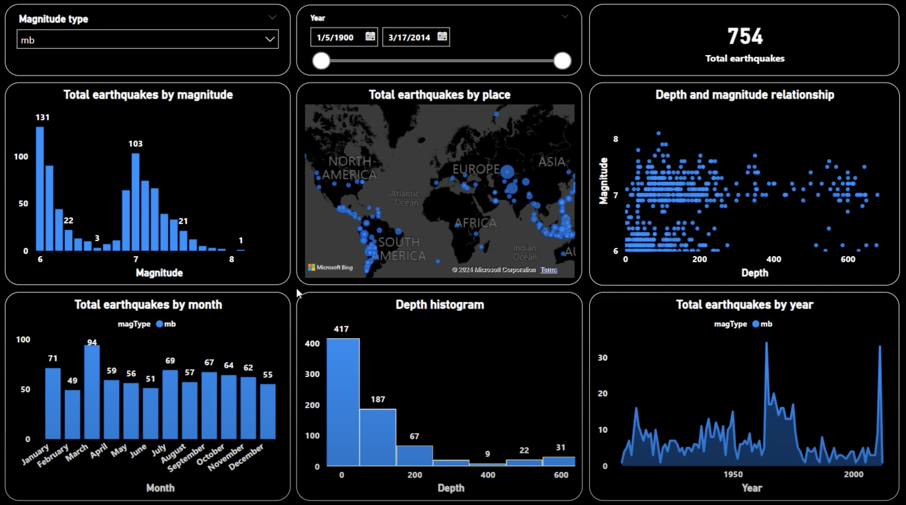

# 🌍 Amazing Power BI Earthquake Dashboard

This interactive dashboard, built with Power BI, visualizes and analyzes global earthquake data between **1900 and 2014**.

## 📊 Dashboard Highlights:

- **Dynamic Filters:** Choose magnitude type (`mb`, `Ms`, `Mw`) and select any date range.
- **Global Map:** Displays all recorded earthquake locations using Bing Maps.
- **Magnitude Analysis:** Histogram of total earthquakes by magnitude.
- **Monthly Trend:** Shows the number of earthquakes for each month.
- **Depth Insights:** Histogram and scatter plot showing depth vs magnitude.
- **Yearly Trend:** Line chart illustrating how earthquake frequency changed over time.
- **Total Counter:** View total filtered earthquakes instantly.

## 📌 Key Insights:

- Most earthquakes occurred with magnitudes between **6.0 and 7.5**.
- Earthquakes are more frequent at **shallow depths (<200 km)**.
- April had the highest number of earthquakes.
- Significant increase in earthquake records after **1950**.

## 🛠️ Tools & Technologies:

- **Power BI**
- **Microsoft Bing Maps**
- **USGS Earthquake Dataset** (1900–2014)

## 📷 Screenshot:

## 👩‍💻 Created by:

**Mariam Raafat**  
*Data Analyst & Power BI Enthusiast*
